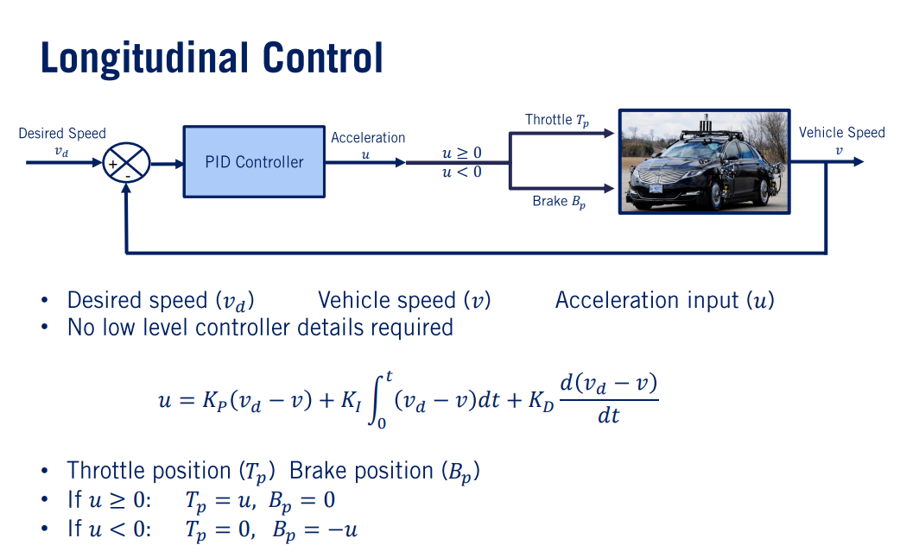
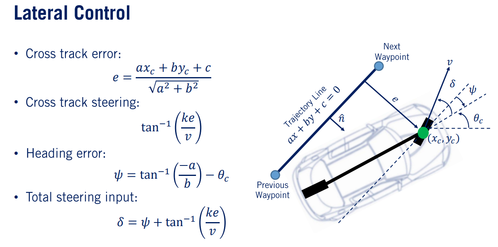

# VehicleControl_SelfDrivingCars

Longitudinal PID Control and a Lateral Controller for a vehicle to follow a racetrack using waypoints is implemented in CARLA Simulator.This code was written as a Project for the SelfDrivingCars Course provided in Coursera by University of Toronto.

The results of the simulation can be viewed in the provided video link :

The Concepts used for Longitudinal controller:

The Concepts used for Longitudinal controller:

